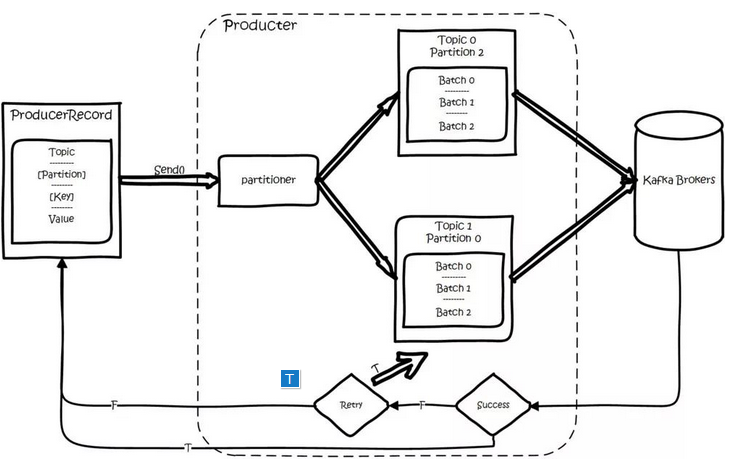

# Apache kafka

- [Apache kafka](#apache-kafka)
  - [1. Apache Kafka 简介](#1-apache-kafka-简介)
    - [1.1. Apache Kafka基本原理](#11-apache-kafka基本原理)
  - [2. Apache Kafka 集群架构](#2-apache-kafka-集群架构)
  - [3. Apache Kafka 工作流程](#3-apache-kafka-工作流程)
    - [3.1. 发布 - 订阅消息的工作流程](#31-发布---订阅消息的工作流程)
    - [3.2. 队列消息/用户组的工作流](#32-队列消息用户组的工作流)
    - [3.3. ZooKeeper 的作用](#33-zookeeper-的作用)
  - [4. Apache Kafka 安装步骤](#4-apache-kafka-安装步骤)
  - [5. Apache Kafka 基本操作](#5-apache-kafka-基本操作)

## 1. Apache Kafka 简介

Apache Kafka是一个分布式发布 - 订阅消息系统和一个强大的队列，可以处理大量的数据，并使您能够将消息从一个端点传递到另一个端点。 Kafka适合离线和在线消息消费。 Kafka消息保留在磁盘上，并在群集内复制以防止数据丢失。 Kafka构建在ZooKeeper同步服务之上。 它与Apache Storm和Spark非常好地集成，用于实时流式数据分析。  
Kafka 是一个分布式消息队列，具有高性能、持久化、多副本备份、横向扩展能力。生产者往队列里写消息，消费者从队列里取消息进行业务逻辑。一般在架构设计中起到解耦、削峰、异步处理的作用。

> Kafka的几个好处

1. 可靠性 - Kafka是分布式，分区，复制和容错的。
2. 可扩展性 - Kafka消息传递系统轻松缩放，无需停机。
3. 耐用性 - Kafka使用分布式提交日志，这意味着消息会尽可能快地保留在磁盘上，因此它是持久的。
4. 性能 - Kafka对于发布和订阅消息都具有高吞吐量。 即使存储了许多TB的消息，它也保持稳定的性能。

> Kafka使用场景

1. 指标 - Kafka通常用于操作监控数据。 这涉及聚合来自分布式应用程序的统计信息，以产生操作数据的集中馈送。
2. 日志聚合解决方案 - Kafka可用于跨组织从多个服务收集日志，并使它们以标准格式提供给多个服务器。
3. 流处理 - 流行的框架(如Storm和Spark Streaming)从主题中读取数据，对其进行处理，并将处理后的数据写入新主题，供用户和应用程序使用。 Kafka的强耐久性在流处理的上下文中也非常有用。

> 关键术语

1. 生产者和消费者（producer和consumer）：消息的发送者叫 Producer，消息的使用者和接受者是 Consumer，生产者将数据保存到 Kafka 集群中，消费者从中获取消息进行业务的处理。
2. broker：Kafka 集群中有很多台 Server，其中每一台 Server 都可以存储消息，将每一台 Server 称为一个 kafka 实例，也叫做 broker。
3. 主题（topic）：一个 topic 里保存的是同一类消息，相当于对消息的分类，每个 producer 将消息发送到 kafka 中，都需要指明要存的 topic 是哪个，也就是指明这个消息属于哪一类。
4. 分区（partition）：每个 topic 都可以分成多个 partition，每个 partition 在存储层面是 append log 文件。任何发布到此 partition 的消息都会被直接追加到 log 文件的尾部。为什么要进行分区呢？最根本的原因就是：kafka基于文件进行存储，当文件内容大到一定程度时，很容易达到单个磁盘的上限，因此，采用分区的办法，一个分区对应一个文件，这样就可以将数据分别存储到不同的server上去，另外这样做也可以负载均衡，容纳更多的消费者。
5. 偏移量（Offset）：一个分区对应一个磁盘上的文件，而消息在文件中的位置就称为 offset（偏移量），offset 为一个 long 型数字，它可以唯一标记一条消息。由于kafka 并没有提供其他额外的索引机制来存储 offset，文件只能顺序的读写，所以在kafka中几乎不允许对消息进行“随机读写”。


### 1.1. Apache Kafka基本原理

> 分布式和分区（distributed、partitioned）

一个 topic 对应的多个 partition 分散存储到集群中的多个 broker 上，存储方式是一个 partition 对应一个文件，每个 broker 负责存储在自己机器上的 partition 中的消息读写。

> 副本（replicated ）

kafka 还可以配置 partitions 需要备份的个数(replicas),每个 partition 将会被备份到多台机器上,以提高可用性，备份的数量可以通过配置文件指定。  

这种冗余备份的方式在分布式系统中是很常见的，那么既然有副本，就涉及到对同一个文件的多个备份如何进行管理和调度。kafka 采取的方案是：每个 partition 选举一个 server 作为“leader”，由 leader 负责所有对该分区的读写，其他 server 作为 follower 只需要简单的与 leader 同步，保持跟进即可。如果原来的 leader 失效，会重新选举由其他的 follower 来成为新的 leader。  

至于如何选取 leader，实际上如果我们了解 ZooKeeper，就会发现其实这正是 Zookeeper 所擅长的，Kafka 使用 ZK 在 Broker 中选出一个 Controller，用于 Partition 分配和 Leader 选举。实际上作为 leader 的 server 承担了该分区所有的读写请求，因此其压力是比较大的，从整体考虑，有多少个 partition 就意味着会有多少个leader，kafka 会将 leader 分散到不同的 broker 上，确保整体的负载均衡.  


> 整体数据流程


（1）数据生产过程（Produce）  

对于生产者要写入的一条记录，可以指定四个参数：分别是 topic、partition、key 和 value，其中 topic 和 value（要写入的数据）是必须要指定的，而 key 和 partition 是可选的。  

对于一条记录，先对其进行序列化，然后按照 Topic 和 Partition，放进对应的发送队列中。如果 Partition 没填，那么情况会是这样的：a、Key 有填。按照 Key 进行哈希，相同 Key 去一个 Partition。b、Key 没填。Round-Robin 来选 Partition。  

对于一条记录，先对其进行序列化，然后按照 Topic 和 Partition，放进对应的发送队列中。如果 Partition 没填，那么情况会是这样的：a、Key 有填。按照 Key 进行哈希，相同 Key 去一个 Partition。b、Key 没填。Round-Robin 来选 Partition。  



producer 将会和Topic下所有 partition leader 保持 socket 连接，消息由 producer 直接通过 socket 发送到 broker。其中 partition leader 的位置( host : port )注册在 zookeeper 中，producer 作为 zookeeper client，已经注册了 watch 用来监听 partition leader 的变更事件，因此，可以准确的知道谁是当前的 leader。  

producer 端采用异步发送：将多条消息暂且在客户端 buffer 起来，并将他们批量的发送到 broker，小数据 IO 太多，会拖慢整体的网络延迟，批量延迟发送事实上提升了网络效率。  

（2）数据消费过程（Consume）  

对于消费者，不是以单独的形式存在的，每一个消费者属于一个 consumer group，一个 group 包含多个 consumer。特别需要注意的是：订阅 Topic 是以一个消费组来订阅的，发送到 Topic 的消息，只会被订阅此 Topic 的每个 group 中的一个 consumer 消费。  

如果所有的 Consumer 都具有相同的 group，那么就像是一个点对点的消息系统；如果每个 consumer 都具有不同的 group，那么消息会广播给所有的消费者。  

具体说来，这实际上是根据 partition 来分的，一个 Partition，只能被消费组里的一个消费者消费，但是可以同时被多个消费组消费，消费组里的每个消费者是关联到一个 partition 的，因此有这样的说法：对于一个 topic,同一个 group 中不能有多于 partitions 个数的 consumer 同时消费,否则将意味着某些 consumer 将无法得到消息。  

同一个消费组的两个消费者不会同时消费一个 partition。  

在 kafka 中，采用了 pull 方式，即 consumer 在和 broker 建立连接之后，主动去 pull(或者说 fetch )消息，首先 consumer 端可以根据自己的消费能力适时的去 fetch 消息并处理，且可以控制消息消费的进度(offset)。  

partition 中的消息只有一个 consumer 在消费，且不存在消息状态的控制，也没有复杂的消息确认机制，可见 kafka broker 端是相当轻量级的。当消息被 consumer 接收之后，需要保存 Offset 记录消费到哪，保存在一个名叫 consumeroffsets topic 的 Topic 中，由此可见，consumer 客户端也很轻量级。  

4、消息传送机制  
Kafka 支持 3 种消息投递语义,在业务中，常常都是使用 At least once 的模型。  

At most once：最多一次，消息可能会丢失，但不会重复。  
At least once：最少一次，消息不会丢失，可能会重复。  
Exactly once：只且一次，消息不丢失不重复，只且消费一次。  

## 2. Apache Kafka 集群架构


1. **Broker（代理）** Kafka集群通常由多个代理组成以保持负载平衡。 Kafka代理是无状态的，所以他们使用ZooKeeper来维护它们的集群状态。 一个Kafka代理实例可以每秒处理数十万次读取和写入，每个Broker可以处理TB的消息，而没有性能影响。 Kafka经纪人领导选举可以由ZooKeeper完成。
2. **ZooKeeper** ZooKeeper用于管理和协调Kafka代理。 ZooKeeper服务主要用于通知生产者和消费者Kafka系统中存在任何新代理或Kafka系统中代理失败。 根据Zookeeper接收到关于代理的存在或失败的通知，然后生产者和消费者采取决定并开始与某些其他代理协调他们的任务。
3. **Producers（生产者）** 生产者将数据推送给经纪人。 当新代理启动时，所有生产者搜索它并自动向该新代理发送消息。 Kafka生产者不等待来自代理的确认，并且发送消息的速度与代理可以处理的一样快。
4. **Consumers（消费者）** 因为Kafka代理是无状态的，这意味着消费者必须通过使用分区偏移来维护已经消耗了多少消息。 如果消费者确认特定的消息偏移，则意味着消费者已经消费了所有先前的消息。 消费者向代理发出异步拉取请求，以具有准备好消耗的字节缓冲区。 消费者可以简单地通过提供偏移值来快退或跳到分区中的任何点。 消费者偏移值由ZooKeeper通知。

## 3. Apache Kafka 工作流程

### 3.1. 发布 - 订阅消息的工作流程

Pub-Sub 消息的逐步工作流程

1. 生产者定期向主题发送消息。
2. Kafka 代理存储为该特定主题配置的分区中的所有消息。 它确保消息在分区之间平等共享。 如果生产者发送两个消息并且有两个分区，Kafka 将在第一分区中存储一个消息，在第二分区中存储第二消息。
3. 消费者订阅特定主题。
4. 一旦消费者订阅主题，Kafka 将向消费者提供主题的当前偏移，并且还将偏移保存在 Zookeeper 系统中。
5. 消费者将定期请求 Kafka (如100 Ms)新消息。
6. 一旦 Kafka 收到来自生产者的消息，它将这些消息转发给消费者。
消费者将收到消息并进行处理。
7. 一旦消息被处理，消费者将向 Kafka 代理发送确认。
8. 一旦 Kafka 收到确认，它将偏移更改为新值，并在 Zookeeper 中更新它。 由于偏移在 Zookeeper 中维护，消费者可以正确地读取下一封邮件，即使在服务器暴力期间。
9. 以上流程将重复，直到消费者停止请求。
10. 消费者可以随时回退/跳到所需的主题偏移量，并阅读所有后续消息。

### 3.2. 队列消息/用户组的工作流

在队列消息传递系统而不是单个消费者中，具有相同组 ID 的一组消费者将订阅主题。 简单来说，订阅具有相同 Group ID 的主题的消费者被认为是单个组，并且消息在它们之间共享。  

1. 生产者以固定间隔向某个主题发送消息。
2. Kafka存储在为该特定主题配置的分区中的所有消息，类似于前面的方案。
3. 单个消费者订阅特定主题，假设 Topic-01 为 Group ID 为 Group-1 。
4. Kafka 以与发布 - 订阅消息相同的方式与消费者交互，直到新消费者以相同的组 ID 订阅相同主题Topic-01  1 。
5. 一旦新消费者到达，Kafka 将其操作切换到共享模式，并在两个消费者之间共享数据。 此共享将继续，直到用户数达到为该特定主题配置的分区数。
6. 一旦消费者的数量超过分区的数量，新消费者将不会接收任何进一步的消息，直到现有消费者取消订阅任何一个消费者。 出现这种情况是因为 Kafka 中的每个消费者将被分配至少一个分区，并且一旦所有分区被分配给现有消费者，新消费者将必须等待。
7. 此功能也称为使用者组。 同样，Kafka 将以非常简单和高效的方式提供两个系统中最好的。

### 3.3. ZooKeeper 的作用

它是一个分布式配置和同步服务。Zookeeper 是 Kafka 代理和消费者之间的协调接口。Kafka 服务器通过 Zookeeper 集群共享信息。Kafka 在 Zookeeper 中存储基本元数据，例如关于主题，代理，消费者偏移(队列读取器)等的信息。  

由于所有关键信息存储在 Zookeeper 中，并且它通常在其整体上复制此数据，因此Kafka代理/ Zookeeper 的故障不会影响 Kafka 集群的状态。Kafka 将恢复状态，一旦 Zookeeper 重新启动。 这为Kafka带来了零停机时间。Kafka 代理之间的领导者选举也通过使用 Zookeeper 在领导者失败的情况下完成。

## 4. Apache Kafka 安装步骤

> step 1. 机器上安装Java。

> step 2. ZooKeeper框架安装。

1. 下载ZooKeeper：https://zookeeper.apache.org/releases.html#download。  

2. 提取tar文件

```text
cd opt/
tar -zxf apache-zookeeper-3.7.0.tar.gz
cd apache-zookeeper-3.7.0
mkdir data
```

3. 创建配置文件

使用命令vi“conf / zoo.cfg"打开名为 conf / zoo.cfg 的配置文件，并将所有以下参数设置为起点。

```text
vi conf/zoo.cfg
```

```text
tickTime=2000
dataDir=/path/to/zookeeper/data
clientPort=2181
initLimit=5
syncLimit=2
```

一旦配置文件成功保存并再次返回终端，可以启动zookeeper服务器。

4. 启动ZooKeeper服务器

```text
bin/zkServer.sh start
```

5. 启动CLI

```text
bin/zkCli.sh
```

6. 停止Zookeeper服务器

```text
bin/zkServer.sh stop
```

> step 3. Apache Kafka安装

1. 下载Kafka: https://kafka.apache.org/downloads

2. 解压tar文件

```text
cd opt/
tar -zxf kafka_2.11.0.9.0.0 tar.gz
cd kafka_2.11.0.9.0.0
```

3. 启动服务器

```text
bin/kafka-server-start.sh config/server.properties
```

4. 停止服务器

```text
bin/kafka-server-stop.sh config/server.properties
```

## 5. Apache Kafka 基本操作


